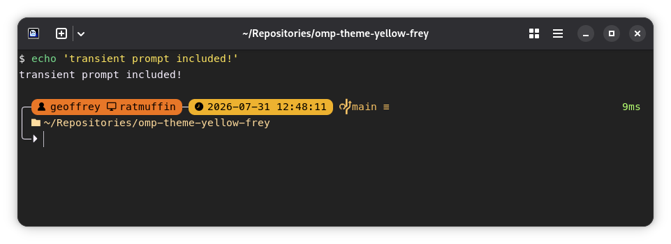
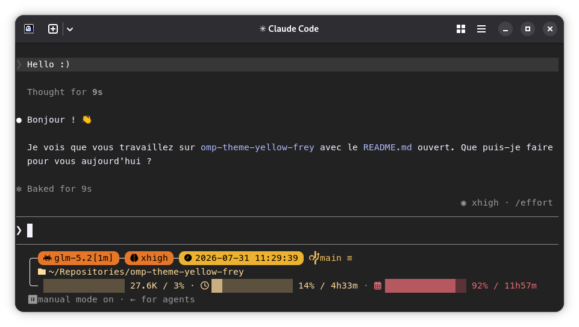

+++
title = "Fabriquer son propre prompt Zsh... Mais pas que"
date = "2026-07-31"
description = ""
aliases = []
draft = false
+++

Vers 2024, je me suis confronté à un message inattendu : [powerlevel10k](https://github.com/romkatv/powerlevel10k) est déprécié. C'est la tuile, parce que c'est mon prompt shell depuis des années. Alors je cherche des alternatives, des prompts dans [la bibliothèque presque infinie de oh-my-zsh](https://github.com/ohmyzsh/ohmyzsh/wiki/Themes) mais rien à faire, je ne trouve pas. En même temps, je n'échappe pas au scope creep de mes propres demandes : p10k était _bien_ mais pas _parfait_. Et moi, j'aimerais bien parfait.

## Qu'est-ce que je veux, au juste ?

C'est normal que rien ne me convienne, parce que "parfait" c'est très personnel.

J'aime avoir toutes les informations sous les yeux.  
Je compte bien profiter d'un écran moderne, avec de la place à revendre.  
Alors ma liste de requirements se précise :  

- Afficher l'utilisateur et le hostname courant
- Indiquer si on est sur une session SSH
- Afficher le chemin courant entier, avec `$HOME` abbrévié par `~`
- Afficher la date et l'heure au format [ISO 8601](https://fr.wikipedia.org/wiki/ISO_8601)
- Afficher les infos git courantes (branche, staged files, état par rapport au remote...)
- Afficher la durée de la commande lancée, et son code de sortie
- Prompt transient, pour éviter de polluer la sortie
- Que ça soit joli, coloré, et cohérent, avec [des icones nerd font](https://www.nerdfonts.com/cheat-sheet)

Au final, je me rends bien compte que je vais devoir le créer moi-même ce thème, personne n'a exactement les mêmes prérequis et les mêmes goûts.

## Quelles sont mes options ?

Il y a un hic : je déteste la syntaxe Bash/Zsh du fond du coeur.  
Donc ça élimine d'office de créer un thème oh-my-zsh.

Oui ces langages sont _pratiques_, ça ne les rend pas agréables pour autant, ni maintenables. Pire, les "one-liner" font légion. Oui c'est très pratique quand on doit retrouver une commande qu'on va réutiliser régulièrement, non ce n'est pas adapté pour un script de ne serait-ce que 50 lignes. Ecrire du bash, c'est simple. Ecrire du bash maintenable, c'est compliqué.

Mais ce n'est pas la seule façon de rendre son prompt, deux projets populaires et matures retiennent mon attention : [Starship](https://starship.rs/), et [Oh-My-Posh](https://ohmyposh.dev/).

Tous deux supportent Zsh (mon shell de prédilection) ainsi que de nombreux autres shells. Pour autant mon choix se fait tout seul car _seul OMP supporte explicitement le prompt transient sur Zsh_.

## Mon prompt Zsh

En l'espace de quelques heures de bidouillage en me basant sur [le prompt emodipt-extend](https://ohmyposh.dev/docs/themes#emodipt-extend) de la galerie de thèmes OMP, j'ai obtenu un résultat satisfaisant. Je vous présente [yellow-frey](https://github.com/GeoffreyCoulaud/omp-theme-yellow-frey), un prompt jaune et orange de 3 lignes, avec des icones, et surtout qui répond à tous mes critères.

Le gros point fort d'OMP c'est sa configuration par segments en JSON.  
La documentation est claire et exhaustive, c'était simple et agréable à utiliser.

## Ma ligne de statut Claude Code

Début 2026 je me suis mis à utiliser plus souvent des outils de programmation agentique. Avec plusieurs collègues de Pictarine, la décision s'est prise à l'unanimité : Les outils d'Anthropic étaient juste meilleurs que la compétition, que ce soit le chat web Claude ou bien le harnais Claude Code.

Sauf que quand on a une fenêtre de terminal dédiée à son harnais agentique, on ne voit pas son prompt zsh. En fait, même on a d'autres informations contextuelles qu'on voudrait afficher dans la status line.

Au début, j'ai essayé de customiser ma status line en bricolant, mais rien de très esthétique ni complet. Puis par hasard, en naviguant la documentation OMP j'ai remarqué une intégration claude code.

Alors avec un peu d'effort j'ai créé ma propre status line pour claude code. Tant qu'à faire, autant réutiliser le design produit pour le prompt shell, et ajouter des métadonnées spécifiques au harnais... Et voilà, une statusline pour Claude Code :

Et si vous prêtez attention aux informations dans ce screenshot, vous remarquerez une petite curiosité : Cette statusline indique `glm-5.2` comme modèle. Ce n'est pas nouveau, on peut tout à fait utiliser le harnais d'Anthropic avec des fournisseurs tiers, même si on perd quelques intégrations officielles.

Le détail intéressant ici, c'est que les barres d'usage à 5 heures et 7 jours sont renseignées, alors que z.ai ne fournit pas ces informations dans leur API compatible Anthropic... Mais comment est-ce possible ?

Je dois l'avouer.  
J'ai dû faire quelque chose d'horrible.  
J'ai écrit un _script bash_.  

<insérer cri horifié>

Plus sérieusement, j'ai écrit un petit wrapper autour de l'appel OMP qui intercepte les informations fournies par le harnais, détecte le provider, et augmente les données fournies dans le cas GLM/Z.ai avec un appel API à leur endpoint d'utilisation. Si jamais plus tard quelqu'un veut reprendre ça et ajouter des données pour un autre fournisseur, il suffira d'implémenter deux fonctions bash.

### Apparté : GLM Coder

Tant que j'y suis, je profite pour donner un court retour d'expérience sur GLM.

Pour le moment je suis satisfait de la performance pour de la programmation agentique. Je ne discerne _pas de différence de qualité ou vitesse avec un Claude Opus 4.8_, qui était mon modèle par défaut de chez Anthropic.
Cependant, c'est uniquement mon ressenti pour un usage assez cadré. Ce n'est pas représentatif de tous les usages, donc à prendre avec des pincettes.

En revanche, pour moi le plafond du plan GLM Coder Pro est un peu trop bas.
J'atteinds souvent les limites 5h et hebdomadaires chez z.ai alors que ça n'arrive que rarement chez Anthropic. Si je devais donner une estimation, je dirais que le plan est environ 30% plus court. _Pour quelqu'un qui cherche un plan entre Claude Pro et Claude Max 5x, GLM Coder Pro fera probablement l'affaire._

> [!WARNING]
> Le 2026-07-30 les plans GLM Coder existants on été supplantés.  
> Par la même occasion, mon plan a été annoté "Legacy Plan V2".  
> Ces nouveaux plans ne sont pas aussi intéressants.  
> Ils ont des limites environ moitié plus basses, et un coût par crédit environ 2.4x plus cher que sur le plan que j'ai pu expérimenter.

Je ferais un second article pour parler plus en détail de mon expérience GLM.

## Conclusion

C'était amusant de customiser mon prompt et ma status bar, et j'utilise le résultat au quotidien comme prompt sur toutes mes machines.

L'[effet Ikea](https://fr.wikipedia.org/wiki/Effet_Ikea) joue sûrement un peu, mais je trouve très gratifiant de customiser ses outils de travail. Enfin, dans la limite du raisonnable. Je n'ai pas encore jugé viable de me créer une collection de dotfiles qui recouvre tout mon environnement de travail.

Je recommande aux curieux d'expérimenter avec oh-my-posh, quitte à partir d'une base existante comme je l'ai fait. Si mon thème vous intéresse, les instructions d'installation et le code sont [sur Github](https://github.com/GeoffreyCoulaud/omp-theme-yellow-frey). Le projet est sous licence MIT, donc n'importe qui peut utiliser, étudier, modifier, et redistribuer son contenu librement.
